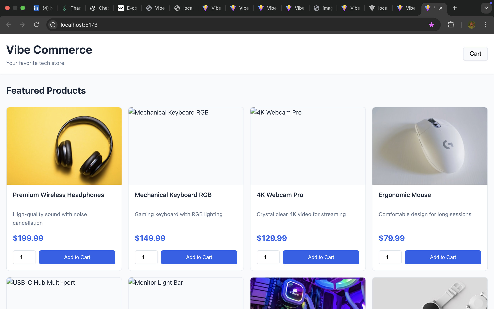
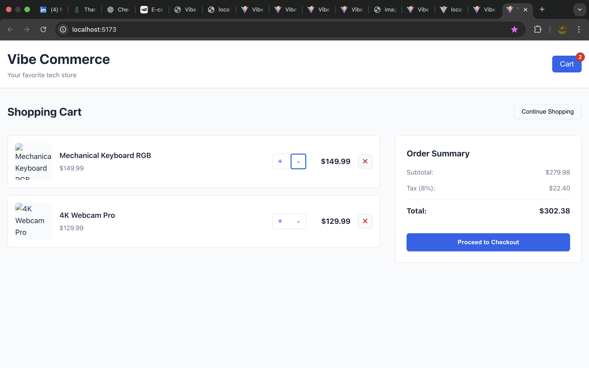
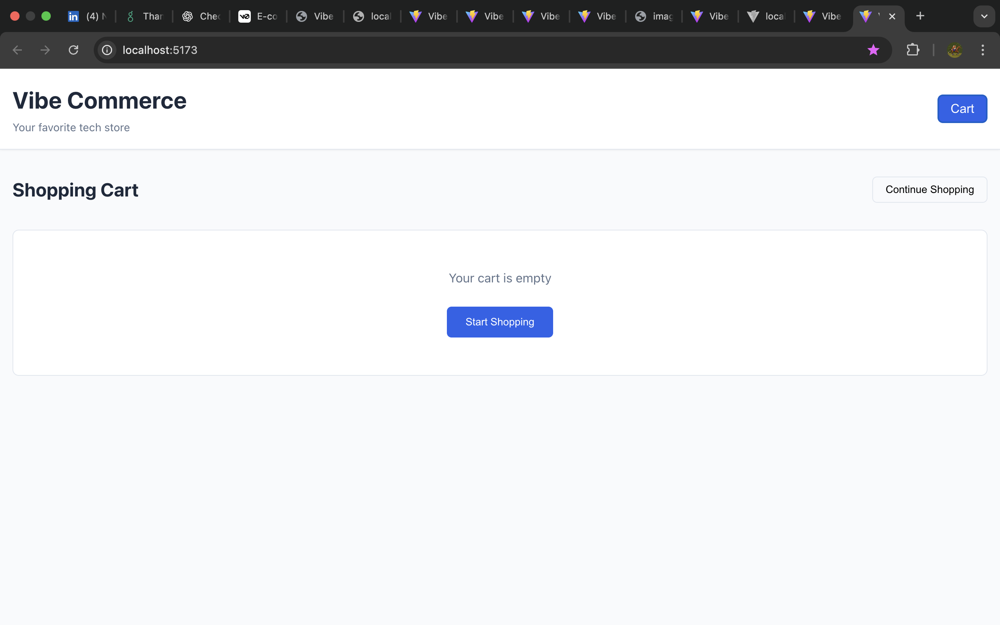
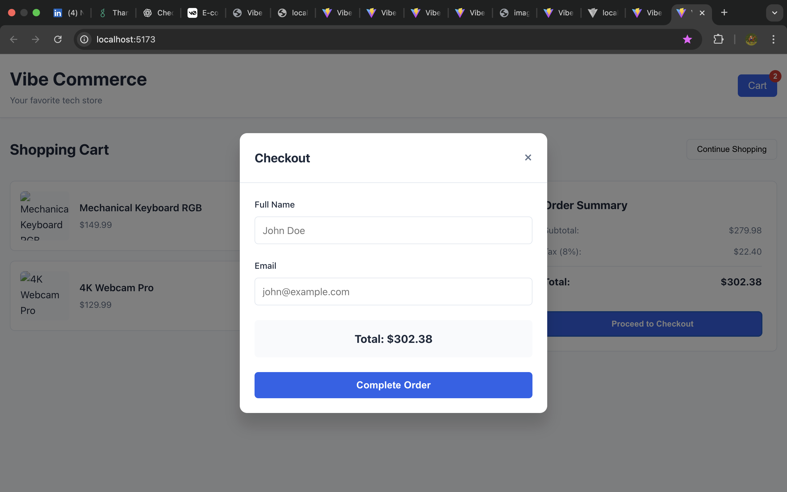
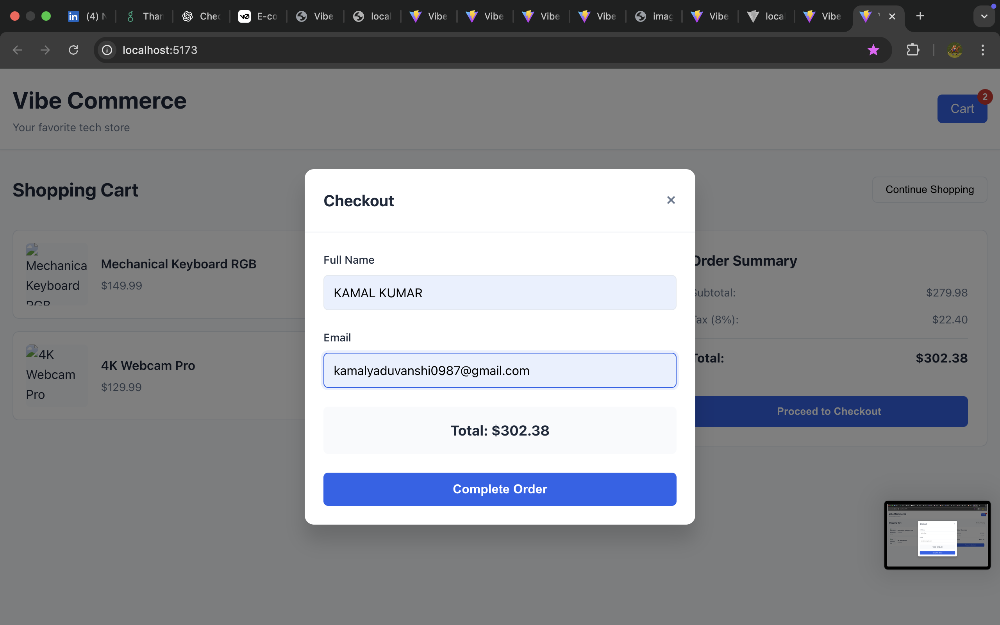
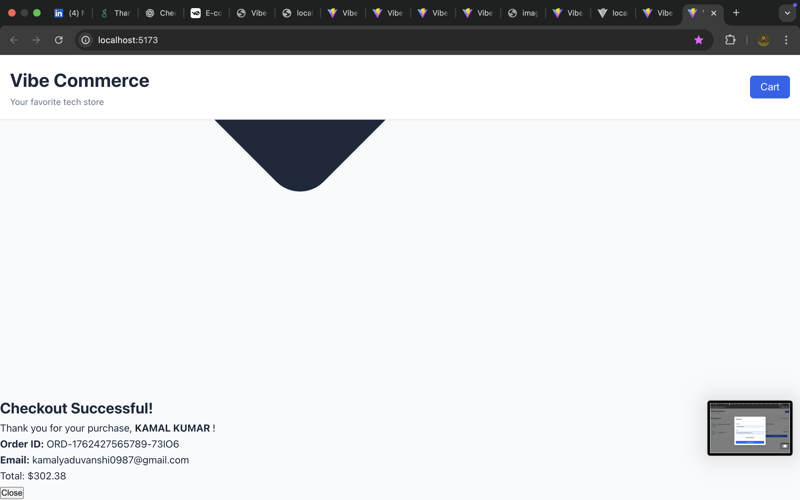

# Vibe Commerce - Full Stack E-Commerce App

A complete full-stack e-commerce shopping cart application built with React (frontend), Express.js (backend), and in-memory data storage.

## Project Structure

```
├── frontend/              # React.js frontend
│   ├── src/
│   │   ├── components/   # React components
│   │   ├── App.jsx       # Main app component
│   │   ├── App.css       # Global styles
│   │   └── index.jsx     # Entry point
│   ├── package.json
│   └── vite.config.js
├── backend/              # Express.js backend
│   ├── server.js         # Main server file
│   └── package.json
└── README.md
```

## Features

### Backend APIs (Express.js)
- `GET /api/products` - Fetch all products
- `POST /api/cart` - Add items to cart
- `GET /api/cart` - Retrieve cart contents
- `DELETE /api/cart/:id` - Remove item from cart
- `PATCH /api/cart/:id` - Update item quantity
- `POST /api/checkout` - Process checkout and generate receipt

### Frontend UI (React)
- Product grid display with images and descriptions
- Add to cart with quantity selector
- Full cart management with update/delete functionality
- Order summary with tax calculation
- Checkout modal with customer form
- Receipt confirmation modal
- Responsive design (mobile-first)
- Error handling and loading states

## Tech Stack

**Frontend:**
- React 18
- Vite (build tool)
- CSS3 (responsive design)
- Fetch API

**Backend:**
- Node.js
- Express.js
- CORS middleware

## Setup & Installation

### Prerequisites
- Node.js (v14+)
- npm or yarn

### Backend Setup

1. Navigate to backend directory:
```bash
cd backend
npm install
```

2. Start the server:
```bash
npm start
```

Server runs on `http://localhost:5001`

For development with auto-reload:
```bash
npm run dev
```

### Frontend Setup

1. Navigate to frontend directory:
```bash
cd frontend
npm install
```

2. Start development server:
```bash
npm run dev
```

3. Open browser to `http://localhost:5173`

**Note:** Frontend will automatically connect to `http://localhost:5000` for API calls. Ensure backend is running first.

## How to Use

1. **Start Backend** (Terminal 1):
   ```bash
   cd backend && npm start
   ```

2. **Start Frontend** (Terminal 2):
   ```bash
   cd frontend && npm run dev
   ```

3. **Open Browser** → Navigate to `http://localhost:5173`

4. **Features**:
   - Browse products in the shop tab
   - Click "Add to Cart" with desired quantity
   - View cart, update quantities, or remove items
   - Click "Proceed to Checkout"
   - Enter name and email
   - View order confirmation receipt

## API Endpoints

### Products
```
GET /api/products
Response: [{ id, name, price, description, image }, ...]
```

### Cart
```
POST /api/cart
Body: { productId, qty, price, name }
Response: { cartId, item, message }

GET /api/cart
Response: { items, total, itemCount }

DELETE /api/cart/:id
Response: { message, remaining }

PATCH /api/cart/:id
Body: { qty }
Response: { message, item }
```

### Checkout
```
POST /api/checkout
Body: { cartItems, customerName, customerEmail }
Response: { orderId, timestamp, items, subtotal, tax, total, ... }
```

## Mock Data

The app includes 8 mock tech products:
- Premium Wireless Headphones ($199.99)
- Mechanical Keyboard RGB ($149.99)
- 4K Webcam Pro ($129.99)
- Ergonomic Mouse ($79.99)
- USB-C Hub Multi-port ($59.99)
- Monitor Light Bar ($89.99)
- Portable SSD 1TB ($119.99)
- Smartwatch Pro ($299.99)

## Features Implemented

✅ Full CRUD operations on cart  
✅ Product browsing and filtering  
✅ Tax calculation (8%)  
✅ Order summary  
✅ Checkout flow with customer details  
✅ Mock receipt generation  
✅ Error handling on both frontend and backend  
✅ Responsive design  
✅ Real-time cart updates  
✅ Item quantity management  

## Bonus Features

- In-memory cart persistence per session
- Product images from external API
- Automatic cart ID generation
- Comprehensive error messages
- Professional UI/UX
- Tab-based navigation (Shop/Cart)
- Sticky order summary

## Demo images

### 1. Product Grid - Featured Products

*Browse through 8 premium tech products with images, descriptions, and "Add to Cart" functionality*

### 2. Product Grid - Full Catalog View

*Complete product listing showing all available items with pricing and quantity selectors*

### 3. Shopping Cart with Items

*Active shopping cart displaying selected products with quantity controls, remove buttons, and order summary showing subtotal, tax (8%), and total*

### 4. Cart with Multiple Items

*Cart page with multiple items showing real-time price calculations and quantity management with increment/decrement controls*

### 5. Empty Cart State

*Clean empty cart state with "Start Shopping" call-to-action button*

### 6. Checkout Modal

*Checkout form modal collecting customer name and email with order total display*

### 7. Checkout Form Filled

*Customer information entered in checkout form ready for order completion*

### 8. Order Confirmation Receipt

*Order confirmation displaying order ID, customer details, and final purchase summary*

## Deployment

### Deploy Backend
- Deploy to Heroku, Railway, or any Node.js hosting
- Set `PORT` environment variable
- Update frontend `VITE_API_URL` to production URL

### Deploy Frontend
- Build: `npm run build`
- Deploy `/dist` folder to Vercel, Netlify, or GitHub Pages

## Database Persistence (Future Enhancement)

Currently uses in-memory storage. To add persistence:
- Connect to MongoDB with Mongoose
- Add authentication with JWT
- Implement user profiles and order history
- Add admin dashboard

## Notes

- All data is in-memory (resets on server restart)
- No real payments processed (mock checkout)
- Images loaded from Unsplash API
- CORS enabled for local development

## Author

Built as a full-stack e-commerce screening project.